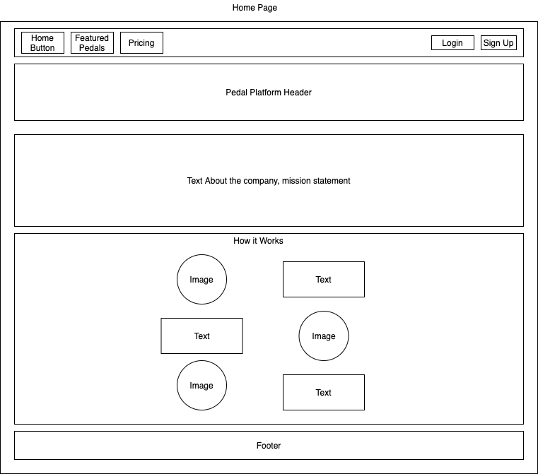
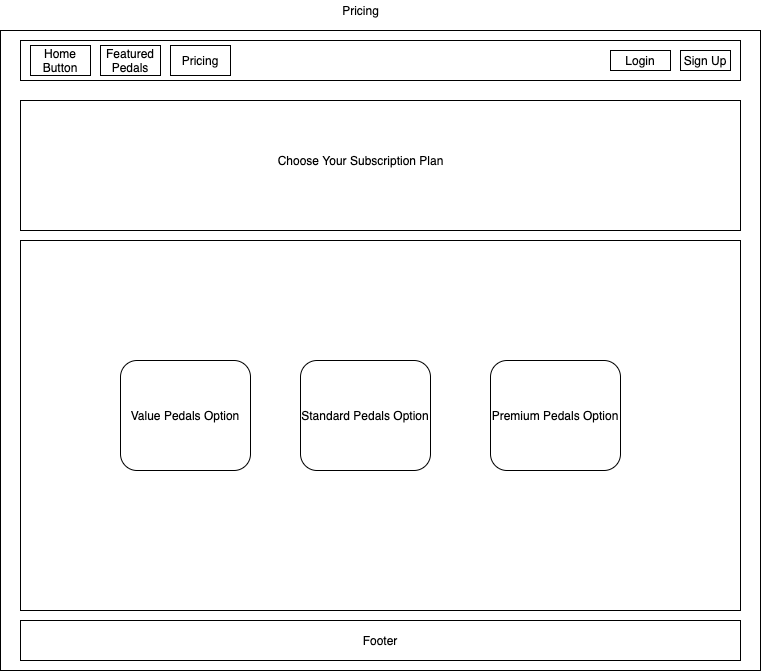
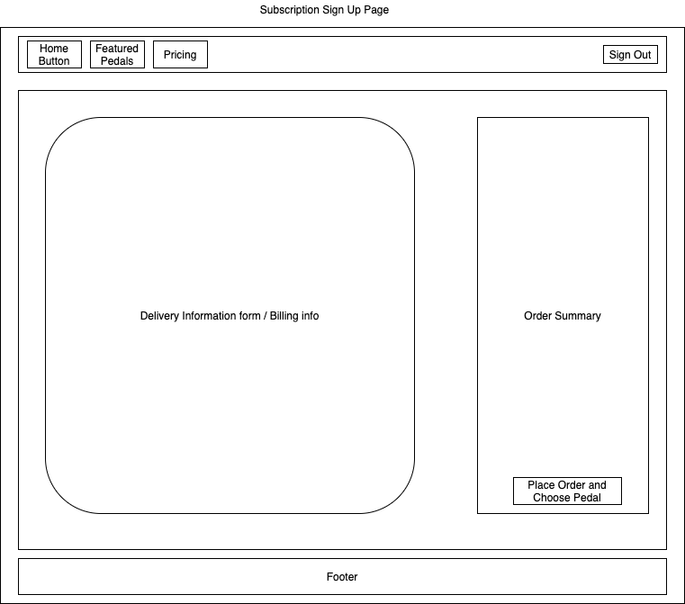
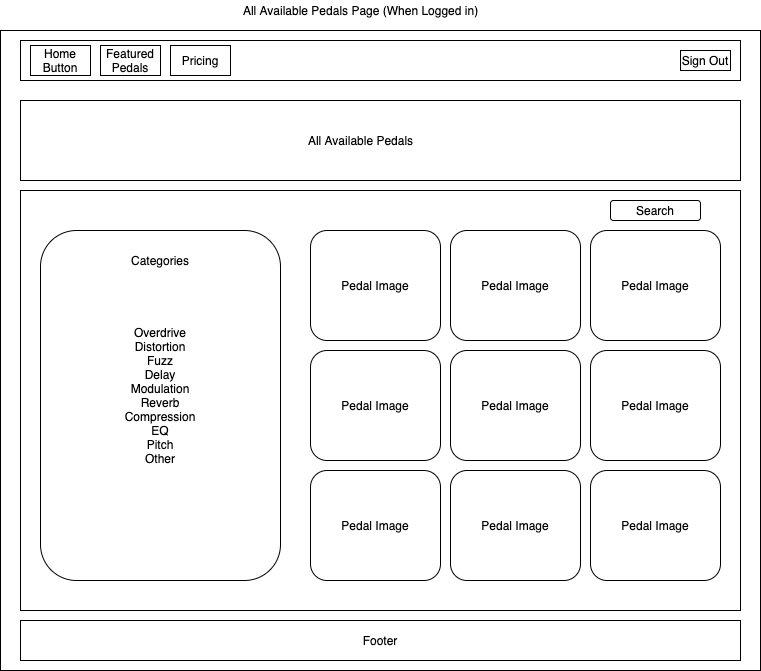
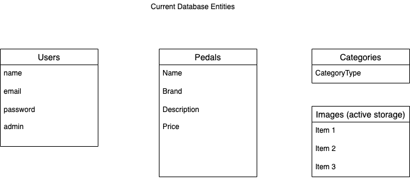

# The Pedal Platform

#### By Austin Butler

## Description

The Pedal Platform is a subscription based ecommerce site for guitar players and musicians to be able to rent and try out new effect pedals for their instruments weekly. This app is designed to be a useful tool to help musicians figure out which pedals work best with their rig.

## User Stories

* As a user I want to see a welcome page that describes the business and how it works
* As a user I want to click on featured pedals and see a list of recent Pedals available based on subscription type
* As a user I want to click on a Pedal and see more information about it
* As a user I want to be able to login and sign up for the service
* As a user I want to be able to fill out a form for delievery and billing information once I sign up
* As a logged in user I want to be able to see a list of all available pedals 
* As a logged in user I want to be able to select a Pedal to rent for the week
* As a logged in user I want to be able to search for a Pedal by name
* As a logged in user I want to be able to click on a Category and get a list of all Pedals in that category
* As an admin I want to be able to add, update, and delete Pedals, and Categorys

## Page Layout

## Database Entities 

## Setup/Installation Requirements

* _Navigate to _
* _Clone the respository to your local machine_
* _Navigate to the cloned directory and open in your text editor of choice to view code_
* _Run the command 'bundle install' to install all gems used in this project_
* _Run the command 'rake db:create' to start the postgresql database_
* _Run the command "rails s" to start a local rails server_
* _Navigate your browser of choice to localhost:3000_

## API's

## Known Bugs
No known bugs at this time

## Technologies Used

* _Ruby_
* _Rails_
* _HTML (erb)_
* _Bootstrap / SASS_

### License

*Licensed under the MIT license*

Copyright (c) 2020 **_Austin Butler_**